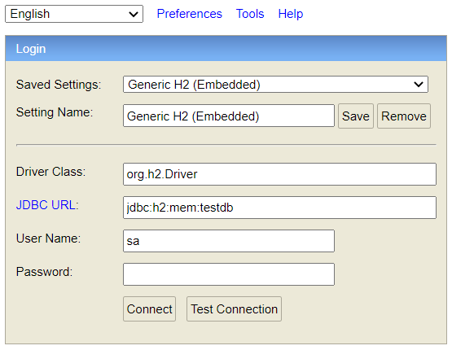

# Spring Boot User API

This is a sample Spring Boot (version 2.3.0) application that can be used as a starter for creating a microservice complete for creating and managing a user repository. I hope it helps you.

## Built With

* 	[Maven](https://maven.apache.org/) - Dependency Management
* 	[JDK](https://www.oracle.com/java/technologies/javase/javase-jdk8-downloads.html) - Java Platform, Standard Edition Development Kit.
* 	[Spring Boot](https://spring.io/projects/spring-boot) - Framework to ease the bootstrapping and development of new Spring Applications.
* 	[git](https://git-scm.com/) - Free and Open-Source distributed version control system.
* 	[IntelliJ IDEA](https://www.jetbrains.com/idea/) - Integrated development environment (IDE) written in Java for developing computer software.
* 	[Swagger](https://swagger.io/) - Open-Source software framework backed by a large ecosystem of tools that helps developers design, build, document, and consume RESTful Web services.

## External Tools Used

*   [User Random Generator](https://randomuser.me) - API to get random users data.
*   [RESTer](https://github.com/frigus02/RESTer) - REST client to test all calls to the API.

# Running the application locally

There are several ways to run a Spring Boot application on your local machine. One way is to execute the `main` method in the `com.agile.content.user.api.Application` class from your IDE (preferably IntelliJ).

- Download the zip or clone the Git repository: https://gitlab.agilecontent.com/tech-challenges/jaime-ramos-java-backend-code-challenge.git.
- Unzip the zip file (if you downloaded one)
- Open Command Prompt and change directory (cd) to the folder containing pom.xml
- Open IntelliJ 
   - File -> Open... -> Navigate to the folder where you unzipped the zip
   - Select the project
- Right Click on "Open as Project" and Run as Java Application

Alternatively, you can use the [Spring Boot Maven plugin](https://docs.spring.io/spring-boot/docs/current/reference/html/build-tool-plugins-maven-plugin.html) like so:

```shell
mvn spring-boot:run
```

## About the Service

The service is just a simple user API REST service. It uses an in-memory database (H2) to store the data. The structure of the database is defined in the file ```src/main/resources/schema.sql```, with the following content:

```sql
drop table IF EXISTS USERS;

create TABLE USERS (
  id INT NOT NULL PRIMARY KEY AUTO_INCREMENT,
  username VARCHAR(250) NOT NULL UNIQUE,
  name VARCHAR(250) NOT NULL,
  email VARCHAR(250) NOT NULL,
  gender VARCHAR(250) NOT NULL,
  picture VARCHAR(250) NOT NULL,
  created DATE NOT NULL,
  updated DATE NOT NULL
);
```

Here is what this little application demonstrates: 

* Full integration with the latest **Spring** Framework.
* Writing a RESTful service supporting JSON requests.
* *Spring Data* Integration with JPA/Hibernate with just a few lines of configuration and familiar annotations. 
* Automatic CRUD functionality against the data source using Spring *Repository* pattern.
* Uses an external API service (Random User Generator API).
* Demonstrates MockMVC test framework with associated libraries (Take a look at: ```src/test/java/com/agile/content/user/api``` test classes).
* The API is "self-documented" by Swagger2 using annotations.

Here are some endpoints you can call:

### Retrieve a list of users

```
http://localhost:8080/api/user

Response: HTTP 200
Content: user list 
```

### Retrieve a paginated list of users

```
http://localhost:8080/api/user?page=2&size=15

Response: HTTP 200
Content: paginated list 
```

### Get a single user

```
http://localhost:8080/api/user/{username}

Response: HTTP 200
Content: user data as JSON format
```

### Create a user resource

```
POST /api/user
Accept: application/json
Content-Type: application/json

{
   "username":"organicfrog326",
   "name":"Oliver Harris",
   "email":"oliver.harris@example.com",
   "gender":"male",
   "picture":"https://randomuser.me/api/portraits/med/men/4.jpg"
}

RESPONSE: HTTP 201 (Created)
Location user: http://localhost:8080/api/user/organicfrog326
```

### Update a user resource

```
PUT /api/user/{username}
Accept: application/json
Content-Type: application/json

{
   "email":"my.new.email@example.com"
}

RESPONSE: HTTP 200
```

### Delete a user resource

```
DELETE /api/user/{username}
Accept: application/json
Content-Type: application/json

RESPONSE: HTTP 200
```

### Generate random users in the system

```
http://localhost:8080/api/user/generate/25

Response: HTTP 200
Content: OK message with the number of the users created. 
```

### To execute tests in the project

You can execute all test developed in ```src/test/java/com/agile/content/user/api``` folder with your ide, click on ```mvn test``` or executing individually in the folder mentioned. 

### To view your H2 in-memory database

The 'test' profile runs on an H2 in-memory database. To view and query the database you can browse to http://localhost:8080/api/h2. The default username is 'sa' with a blank password as you can see in the ```src/main/resources/application.properties``` properties file. Make sure to have the same configuration as in the next picture:



Inside the H2 database management page you can see all data created and stored while you are using the API operations.

### To view Swagger 2 API docs

Run the server and browse to http://localhost:8080/api/swagger-ui.html. Here you can test all operations from the API thanks to the Swagger 2 interfaces. 